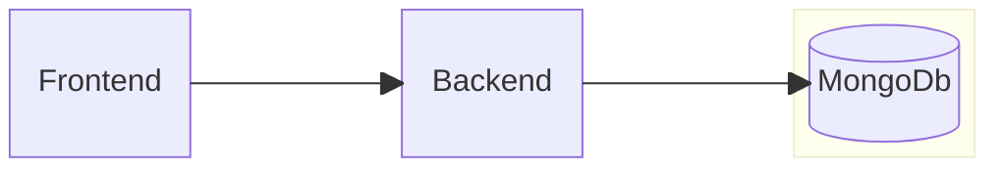

# System Architecture

This document outlines the general strategy of API interaction between the Frontend and Backend.

The overall system of the web application comprises three main systems.

- Frontend (Angular)
- Backend (FastAPI)
- Database (MongoDB)

---

## Local Development

Docker is utilised to containerise `MongoDb` for local development.