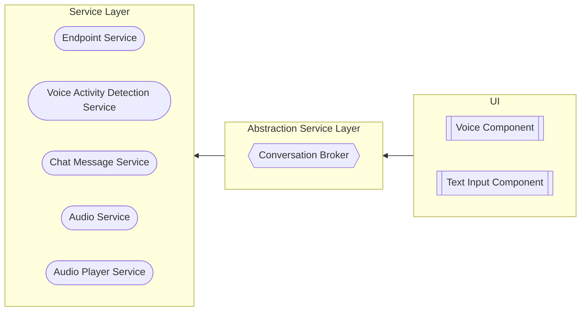

# Introduction

## High Level Dependency

The frontend for HealthierME 2.0 is build using Angular v18.

| Domain    | Technology                              | Remarks                                                          |
|-----------|-----------------------------------------|------------------------------------------------------------------|
| Framework | [Angular v18](https://angular.dev/)     | Modularity between components and business logic.                |
| Component | [PrimeNG](https://angular.dev/)         | Large range of components out of the box.                        |
| Styling   | [TailwindCSS](https://tailwindcss.com/) | Fast tooling for styling of components.                          |
| Icons     | [Lucide](https://lucide.dev/)           | One of the largest icon library with native support for Angular. |

---

## Philosophy

### Data Persistence

To minimise the technical complexity of maintaining states, all stateful logic is handled on the frontend, allowing the backend to be purely stateless. As such, `LocalStorage` and `IndexedDb` stores are used to persist user information. This strategy allows us to make do without an authentication (or user based) system, drastically reducing technical complexity -- particularly important given the short turn around time given to produce a proof-of-concept.

`Message`s are persisted in the browser using `IndexedDb` and are queried by the ID of the profile that is currently being interacted with. This is managed by [ChatMessageService](./services/chat-message.md).

To manage user preferences, `LocalStorage` was used, and is managed by PreferenceService. Preferences include the chat mode, and Voice Activity Detection (VAD) settings.

### Software Architecture

The diagram below shows a _very, very_, high level overview on how the services and components interact with each other.

!!! WARNING

    This diagram does not cover every relation and interaction that has been implemented. It does however give a broad idea of the intention behind the implemented structure and how its abstraction of business logic can be expanded.

    The implemented logic is more nuanced than depicted, with more components and a few more services.

Services can be grouped into two general types, a service to abstract out business logic, Abstraction Service Layer (ASL), and services that are responsible for actionable items, Service Layer (SL).

The ultimate goal of this layered structure was to abstract away business logic from components.

For example, to process a voice input:

1. Voice recording must be started (with or without VAD)
2. An API call must be made
3. The transcribed user message must be persisted
4. The streamed API response must be parsed
5. LLM response must be persisted as a message
6. Audio of the LLM response must be played

By adopting the UI/ASL/SL layer structure, the logic is consolidated into ASL services that can be accessed from other components, encouraging reusability of the business logic and keeping UI components readable and simple to maintain.
