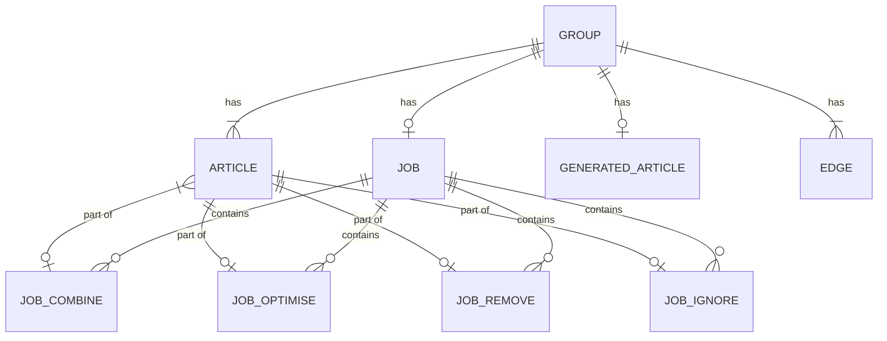

```mermaid
erDiagram
  GROUP ||--o| JOB : has
  GROUP ||--|{ ARTICLE : has
  GROUP ||--o| GENERATED_ARTICLE: has
  GROUP ||--|{ EDGE : has
  ARTICLE |{--o| JOB_COMBINE : "part of"
  ARTICLE ||--o| JOB_IGNORE : "part of"
  ARTICLE ||--o| JOB_REMOVE : "part of"
  ARTICLE ||--o| JOB_OPTIMISE : "part of"
  JOB ||--o{ JOB_COMBINE : contains
  JOB ||--o{ JOB_OPTIMISE : contains
  JOB ||--o{ JOB_REMOVE : contains
  JOB ||--o{ JOB_IGNORE : contains
```
