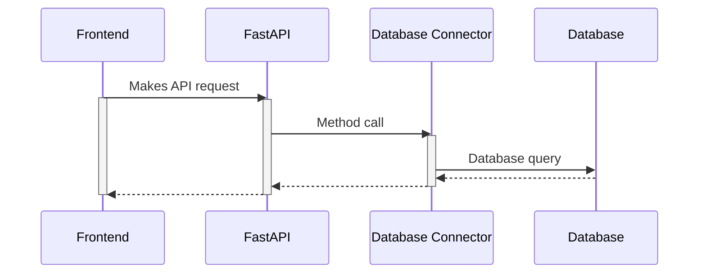

# Introduction

The backend for this webapp has been built with [FastAPI](https://fastapi.tiangolo.com/) as the foundation.
Flexibility of the backend was a key criteria for the software architecture. This is done by adhering to Object-Oriented Principles (OOP) for loose coupling. 

The diagram above is a very high level overview of how database interactions should be made -- by using the [DbConnector](db/db_connector.md) interface to build database connectors. This allows all database queries to be abstracted.