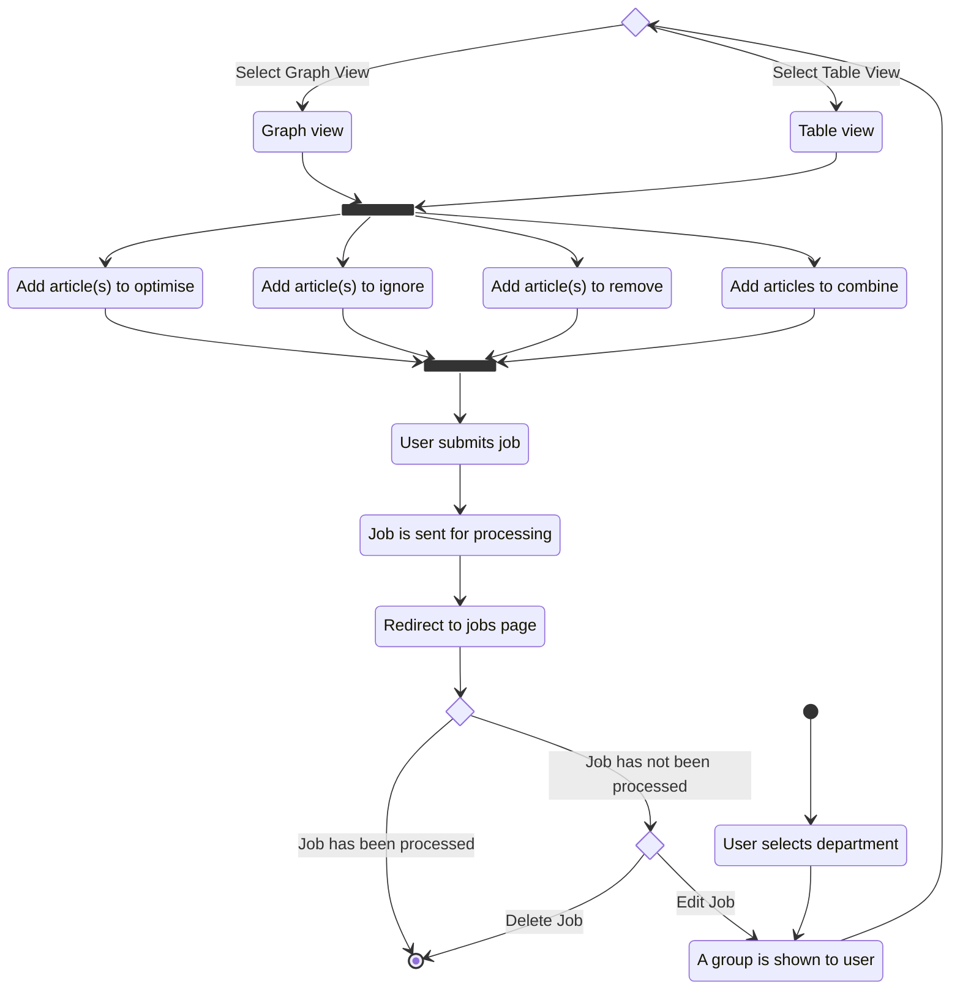

<h1>Front End Activity Diagram<h1>

```mermaid
stateDiagram
    state if_state <<choice>>
    state if_state2 <<choice>>
    state if_state3 <<choice>>
    state fork_state <<fork>>
    state join_state <<join>>

    s1: User selects department
    s2: A group is shown to user
    s3: Graph view
    s4: Table view
    s5: Add article(s) to optimise
    s6: Add article(s) to ignore
    s7: Add article(s) to remove
    s8: Add articles to combine
    s9: User submits job
    s10: Job is sent for processing
    s11: Redirect to jobs page

    [*] --> s1
    s1 --> s2
    s2 --> if_state
    if_state --> s3: Select Graph View
    if_state --> s4: Select Table View
    s3 --> fork_state
    s4 --> fork_state
    fork_state --> s5
    fork_state --> s6
    fork_state --> s7
    fork_state --> s8
    s5 --> join_state
    s6 --> join_state
    s7 --> join_state
    s8 --> join_state
    join_state --> s9
    s9 --> s10
    s10 --> s11
    s11 --> if_state2
    if_state2 --> [*] : Job has been processed
    if_state2 --> if_state3 : Job has not been processed
    if_state3 --> [*] : Delete Job
    if_state3 --> s2 : Edit Job


```
