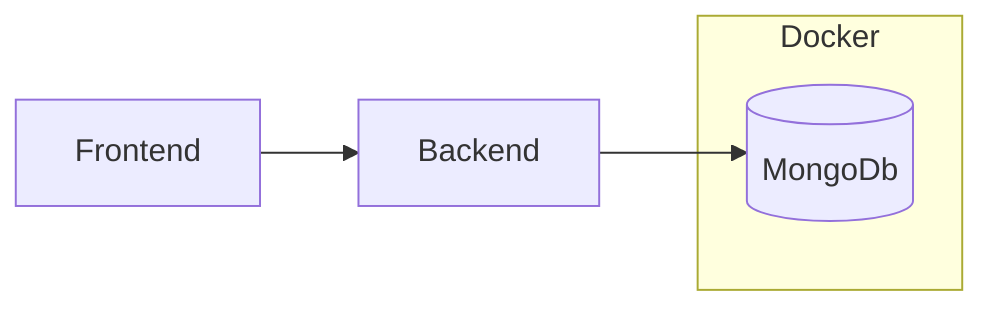

# System Architecture

This document outlines the general strategy of API interaction between the Frontend and Backend.

The overall system of the web application comprises three main systems.

- Frontend (Angular)
- Backend (FastAPI)
- Database (MongoDB)

---

## Local Development

Docker is utilised to containerise `MongoDb` for local development. While at the time of writing, `MongoDb` is the choice of database, it is important to note that the backend is designed to be as database-agnostic as possible.

`MongoDb` was chosen due to its 'schemaless' design, allowing for fast prototyping and adaptability.
